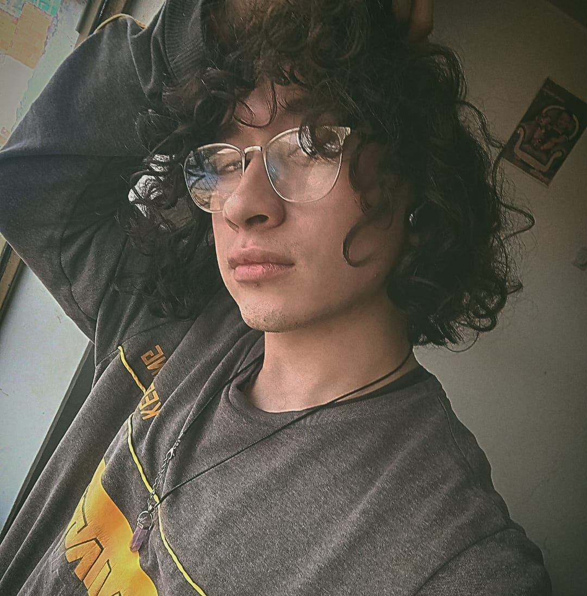
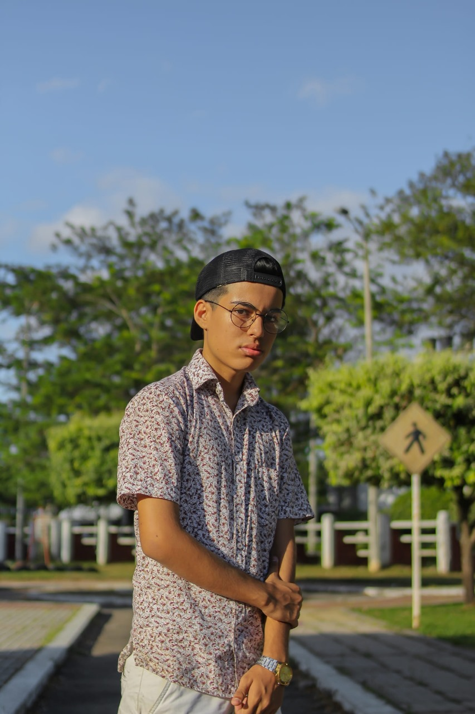
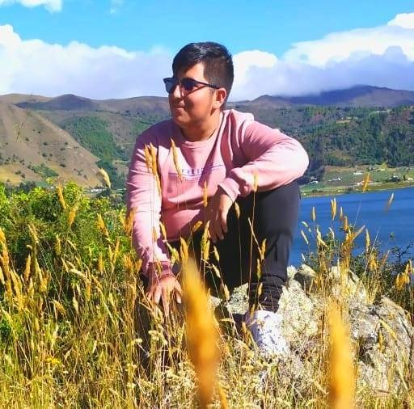
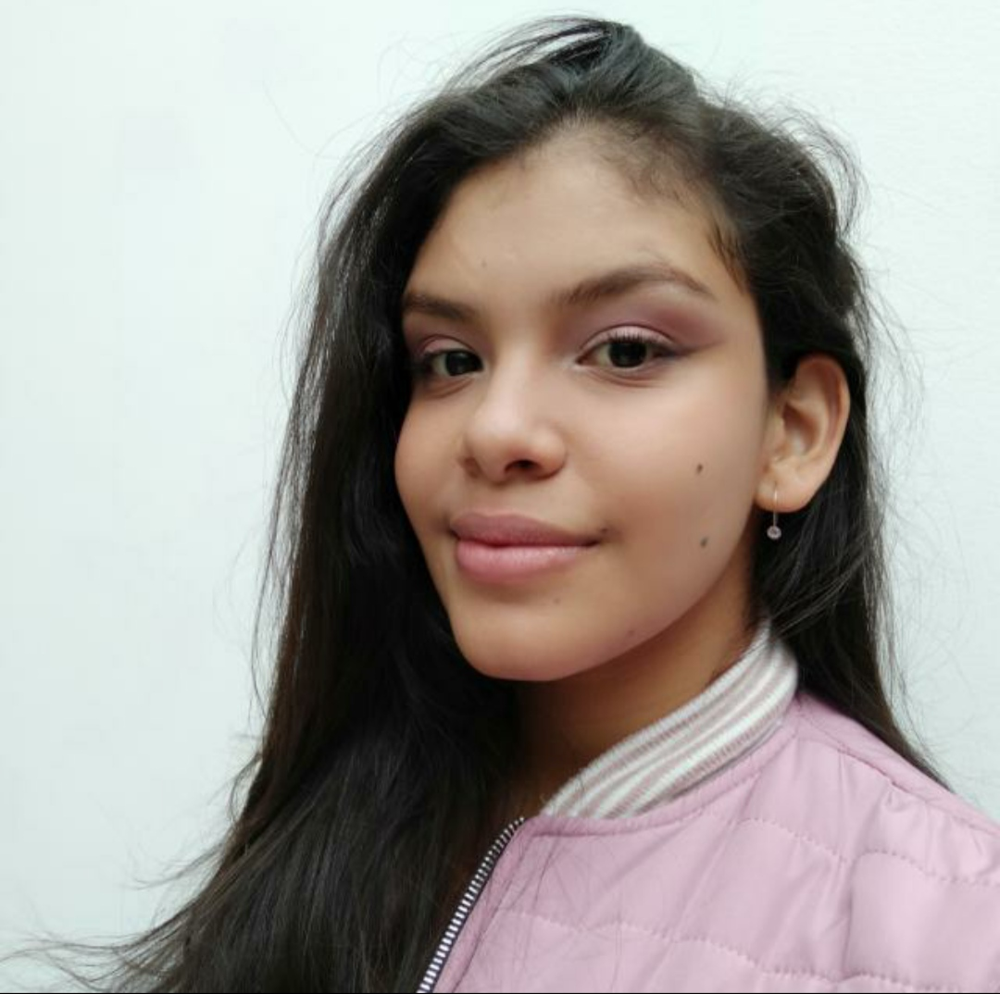

# 🏢 Presentación del Equipo

## 🌟 Nuestro Equipo

### 
### Andres Felipe Vega Gomez
🖥**Rol:** Game Illustrator 
📍**Ubicación:** Duitama-Boyaca 
📌**Perfil:** Apasionado por la tecnología y los videojuegos. Pasando el septimo semestre de Ingenieria Multimedia.

---
### 
### David Fernandez  
🖥 **Rol:** Game Tester  
📍 **Ubicación:** (Yopal/Casanare)  
📌 **Descripción:** Me encargo de probar el videojuego para detectar errores y asegurarme de que la experiencia sea fluida y sin fallos.  

---
### 
### Luis Carlos Castillo Perez
🖥**Rol:** Level Designer
📍**Ubicación:** Duitama-Boyaca 
📌**Descripción:** Me encargo de diseñar los niveles o escenarios de un videojuego, definiendo su estructura, mecánicas, ritmo y desafíos para ofrecer una experiencia equilibrada y divertida.

---
### 
### Darian Nathaly Araque Viera
🖥**Rol:** Game Designer
📌**Descripción del rol:** Un Game Designer es el responsable de diseñar la experiencia de juego, definiendo las mecánicas, reglas, niveles y narrativa del mismo  para asegurar que sea divertido y atractivo para los jugadores. 
📍**Ubicación:** Socha-Boyaca 
📌**Perfil:** Soy una persona creativa, amante de la illustración y tecnología.
